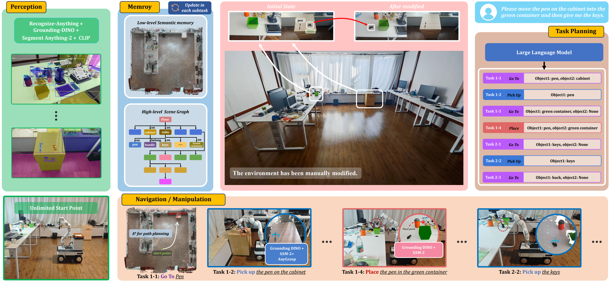

# DovSG
## Dynamic Open-Vocabulary 3D Scene Graphs for Long-term Language-Guided Mobile Manipulation

<!-- ### 📢 News

- 🎉 **2024-10-01**: Accepted by **T-RO '24**!  
- 🚀 **2024-07-02**: Conditionally accepted. -->


## 1 Introduction

**DovSG** constructs a Dynamic 3D Scene Graph and leverages task decomposition with large language models, enabling localized updates of the 3D scene graphs during interactive exploration. This assists mobile robots in accurately executing long-term tasks, even in scenarios where human modifications to the environment are present.


**Contributors**: [Zhijie Yan](https://bjhyzj.github.io), [Shufei Li](https://scholar.google.com/citations?user=CpCQmkwAAAAJ&hl=en), [Zuoxu Wang](https://scholar.google.com/citations?user=kja7k5MAAAAJ&hl=en), [Lixiu Wu](https://scholar.google.com/citations?user=ziAzfCoAAAAJ&hl=en), Han Wang, Jun Zhu, Lijiang Chen, Jihong Liu


<div align="center">
    
</div>


### 1.1 Our paper

Our paper is now available on **arXiv**:  [Dynamic Open-Vocabulary 3D Scene Graphs for Long-term Language-Guided Mobile Manipulation](https://arxiv.org/pdf/2410.11989).

If our code is used in your project, please cite our paper following the bibtex below:

```
@misc{yan2024dynamicopenvocabulary3dscene,
      title={Dynamic Open-Vocabulary 3D Scene Graphs for Long-term Language-Guided Mobile Manipulation}, 
      author={Zhijie Yan and Shufei Li and Zuoxu Wang and Lixiu Wu and Han Wang and Jun Zhu and Lijiang Chen and Jihong Liu},
      year={2024},
      eprint={2410.11989},
      archivePrefix={arXiv},
      primaryClass={cs.RO},
      url={https://arxiv.org/abs/2410.11989}, 
}
```


### 1.2 Our demo

Our accompanying demo are now available on [**YouTube**](https://www.youtube.com/watch?v=xmUCHzE6EYc) and [**Project Page**](https://bjhyzj.github.io/dovsg-web/).

<div align="center">
<a href="https://www.youtube.com/watch?v=xmUCHzE6EYc" target="_blank"></a>
</div>


## 2 Prerequisited
- We have set up all the necessary environments on a Lenovo Y9000K laptop running Ubuntu 20.04, equipped with an NVIDIA RTX 4090 GPU with 16GB of VRAM.

- We used a real-world setup with a <a herf="https://www.cn.ufactory.cc/xarm">UFACTORY xARM6</a> robotic arm on an <a herf="https://www.agilex.ai/chassis/6">Agilex Ranger Mini 3</a> mobile base, equipped with a <a herf="https://www.intelrealsense.com/depth-camera-d455/">RealSense D455</a> camera for perception and a basket for item transport.


### 2.1 Ubuntu and ROS
Ubuntu 20.04. [ROS Installation](http://wiki.ros.org/ROS/Installation).

### 2.1 Environment Setup
- Install **DROID-SLAM** environment for scan the room: [install_droidslam.md](docs/install_droidslam.md).

- Install **DovSG** environment for running the DovSG: [install_dovsg.md](docs/install_dovsg.md).

- Download checkpoints: [down_checkpoints.md](docs/down_checkpoints.md)

## 3 Run DovSG

### 3.1 Run our demo
You can directly download the pre-recorded scenes we provided from <a href="https://drive.google.com/drive/folders/13v5QOrqjxye__kJwDIuD7kTdeSSNfR5x?usp=sharing">Google Cloud</a>. Please place them in the project's root directory, specifically in `DovSG/data_example`, and set the tags to `your_name_of_scene`, such as `room1`.

```bash
python demo.py --tags room1 preprocess --debug --task_scene_change_level "Minor Adjustment" --task_description "Please move the red pepper to the plate, then move the green pepper to plate."
```

### 3.2 Run on real world workstation
You need to refer to <a herf="https://github.com/agilexrobotics/ranger_ros">here</a> to configure the aglix ranger mini.

3.2.1 You should Scanning the room for memory
```bash
python demo.py --tags `your_name_of_scene` --scanning_room --preprocess --task_scene_change_level your_task_scene_change_level --task_description your_task_description
```

3.2.2 In one terminal run the hardcode.
```bash
cd hardcode
source ~/agilex_ws/devel/setup.bash
rosrun ranger_bringup bringup_can2usb.bash
roslaunch ranger_bringup ranger_mini_v2.launch

# You need to replace the port with your own.
python server.py  
```

3.2.3 In another terminal run the Navigation and Manipulation Module.
```bash
python demo.py --tags `your_name_of_scene` --preprocess --task_scene_change_level your_task_scene_change_level --task_description your_task_description 
```


## Reference
- Ok-Robot: [https://ok-robot.github.io/](https://ok-robot.github.io/)
- RoboEXP: [https://github.com/Jianghanxiao/RoboEXP](https://github.com/Jianghanxiao/RoboEXP)
- ConceptGraphs: [https://github.com/concept-graphs/concept-graphs](https://github.com/concept-graphs/concept-graphs)
